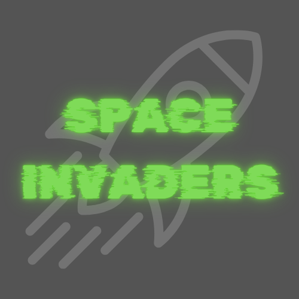
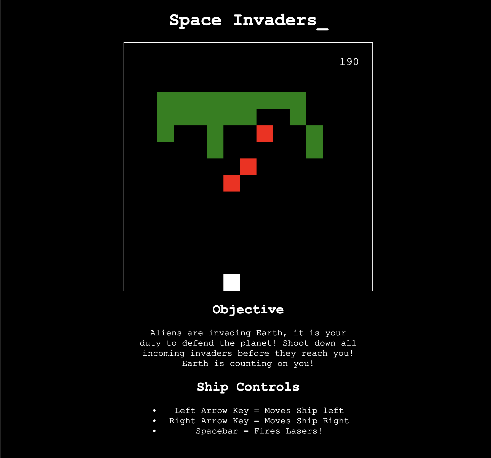

# Space Invaders

Space Invaders is a classic arcade style shooter game where players defend Earth from an alien invasion. 

The objective destroy all alien ships before they reach the bottom of the screen!

## Controls

- Arrow Left = Moves player ship left
- Arrow Right = Moves player ship right
- Spacebar = Fires laser

## Scoring

Destroying alien invaders will get you 10pts each! 

## Screenshots

## Development

- ### This game was developed with the following technologies:
- HTML
- CSS
- JavaScript

## Future Implementations 

- Multiplayer Mode : Introducing a Co-op mode where players can defend Earth together.
- New Alien Types : Adding a variety of different Alien types, behaviors and movement patterns.
- Level System : Can move through different sectors and progress through a storyline
- Boss battles : Introducing boss battles at the end of eah mission set
- Power Ups : Power ups, that porvide player with different weapons, speed or health enhancements
